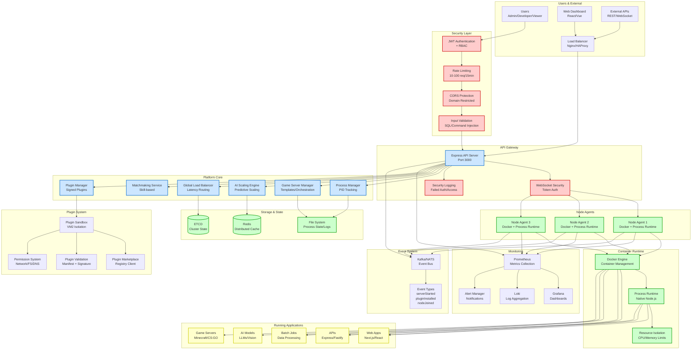

# ANCHOR Platform Architecture Diagram

```mermaid
graph TB
    %% Users and External Access
    subgraph "Users & External"
        U[Users<br/>Admin/Developer/Viewer]
        LB[Load Balancer<br/>Nginx/HAProxy]
        WS[Web Dashboard<br/>React/Vue]
        API[External APIs<br/>REST/WebSocket]
    end

    %% Security Layers
    subgraph "Security Layer"
        AUTH[JWT Authentication<br/>+ RBAC]
        RL[Rate Limiting<br/>10-100 req/15min]
        CORS[CORS Protection<br/>Domain Restricted]
        VAL[Input Validation<br/>SQL/Command Injection]
    end

    %% API Gateway
    subgraph "API Gateway"
        AG[Express API Server<br/>Port 3000]
        WS_SEC[WebSocket Security<br/>Token Auth]
        LOG_SEC[Security Logging<br/>Failed Auth/Access]
    end

    %% Platform Core
    subgraph "Platform Core"
        PM[Process Manager<br/>PID Tracking]
        GSM[Game Server Manager<br/>Templates/Orchestration]
        SE[AI Scaling Engine<br/>Predictive Scaling]
        LB_CORE[Global Load Balancer<br/>Latency Routing]
        MM[Matchmaking Service<br/>Skill-based]
        PLM[Plugin Manager<br/>Signed Plugins]
    end

    %% Plugin System
    subgraph "Plugin System"
        PS[Plugin Sandbox<br/>VM2 Isolation]
        PMAN[Plugin Marketplace<br/>Registry Client]
        PVAL[Plugin Validation<br/>Manifest + Signature]
        PPERM[Permission System<br/>Network/FS/DNS]
    end

    %% Node Agents
    subgraph "Node Agents"
        NA1[Node Agent 1<br/>Docker + Process Runtime]
        NA2[Node Agent 2<br/>Docker + Process Runtime]
        NA3[Node Agent 3<br/>Docker + Process Runtime]
    end

    %% Container Runtime
    subgraph "Container Runtime"
        DOCKER[Docker Engine<br/>Container Management]
        PROC[Process Runtime<br/>Native Node.js]
        ISOL[Resource Isolation<br/>CPU/Memory Limits]
    end

    %% Storage & State
    subgraph "Storage & State"
        FS[File System<br/>Process State/Logs]
        REDIS[(Redis<br/>Distributed Cache)]
        ETCD[(ETCD<br/>Cluster State)]
    end

    %% Monitoring & Observability
    subgraph "Monitoring"
        PROM[Prometheus<br/>Metrics Collection]
        GRAF[Grafana<br/>Dashboards]
        LOKI[Loki<br/>Log Aggregation]
        ALERT[Alert Manager<br/>Notifications]
    end

    %% Event System
    subgraph "Event System"
        KAFKA[Kafka/NATS<br/>Event Bus]
        EVT[Event Types<br/>serverStarted<br/>pluginInstalled<br/>nodeJoined]
    end

    %% Applications
    subgraph "Running Applications"
        WEB[Web Apps<br/>Next.js/React]
        API_APPS[APIs<br/>Express/Fastify]
        AI[AI Models<br/>LLMs/Vision]
        GAMES[Game Servers<br/>Minecraft/CS:GO]
        JOBS[Batch Jobs<br/>Data Processing]
    end

    %% Connections
    U --> AUTH
    WS --> LB
    API --> LB
    LB --> AG

    AUTH --> RL
    RL --> CORS
    CORS --> VAL
    VAL --> AG

    AG --> WS_SEC
    AG --> LOG_SEC

    AG --> PM
    AG --> GSM
    AG --> SE
    AG --> LB_CORE
    AG --> MM
    AG --> PLM

    PLM --> PS
    PS --> PMAN
    PS --> PVAL
    PS --> PPERM

    WS_SEC --> NA1
    WS_SEC --> NA2
    WS_SEC --> NA3

    NA1 --> DOCKER
    NA2 --> DOCKER
    NA3 --> DOCKER

    DOCKER --> PROC
    PROC --> ISOL

    PM --> FS
    GSM --> FS
    SE --> REDIS
    LB_CORE --> ETCD

    AG --> PROM
    NA1 --> PROM
    NA2 --> PROM
    NA3 --> PROM

    PROM --> GRAF
    PROM --> LOKI
    PROM --> ALERT

    AG --> KAFKA
    NA1 --> KAFKA
    NA2 --> KAFKA
    NA3 --> KAFKA

    KAFKA --> EVT

    DOCKER --> WEB
    DOCKER --> API_APPS
    DOCKER --> AI
    DOCKER --> GAMES
    DOCKER --> JOBS

    PROC --> WEB
    PROC --> API_APPS
    PROC --> JOBS

    %% Styling
    classDef security fill:#ffcccc,stroke:#cc0000,stroke-width:2px
    classDef core fill:#cce6ff,stroke:#0066cc,stroke-width:2px
    classDef infra fill:#ccffcc,stroke:#009900,stroke-width:2px
    classDef apps fill:#ffffcc,stroke:#cccc00,stroke-width:2px

    class AUTH,RL,CORS,VAL,WS_SEC,LOG_SEC security
    class AG,PM,GSM,SE,LB_CORE,MM,PLM core
    class NA1,NA2,NA3,DOCKER,PROC,ISOL,FS,REDIS,ETCD infra
    class WEB,API_APPS,AI,GAMES,JOBS apps
```